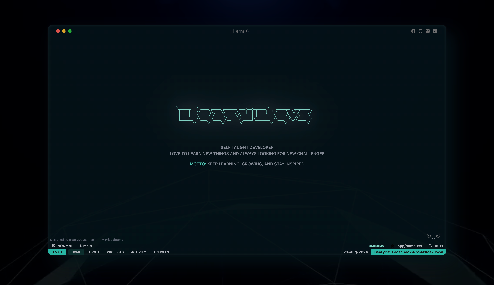
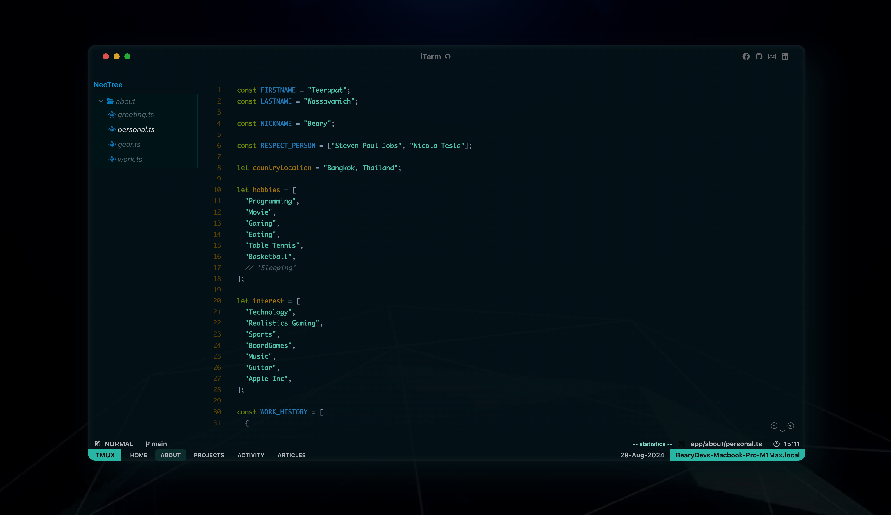
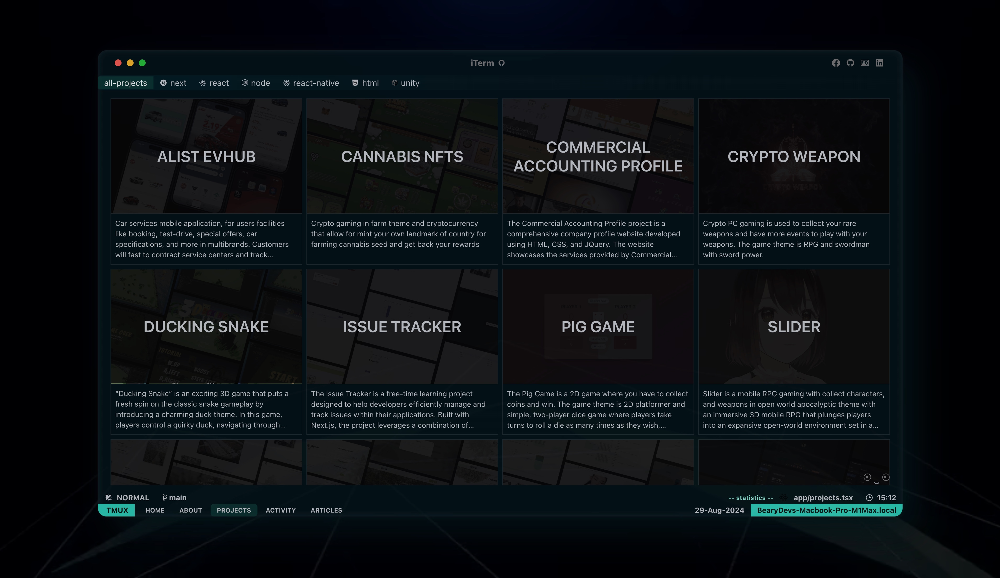
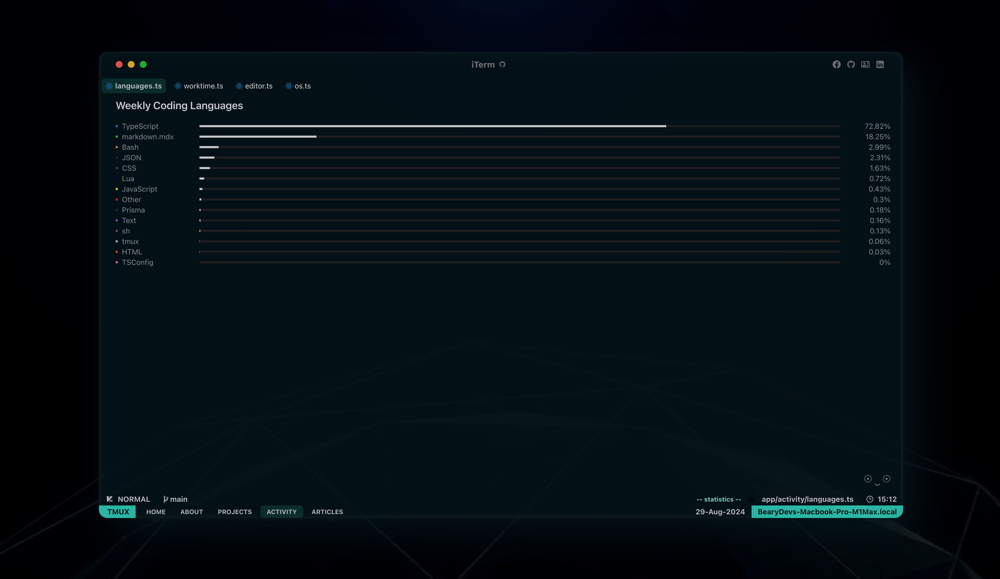
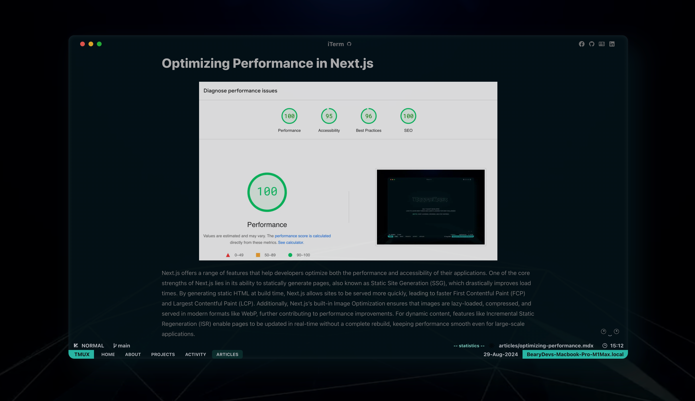

# BearyDevs Homepage

"Designed by BearyDevs, inspired by [Wiscaksono](https://github.com/wiscaksono). Creating to continuously push my limits by setting new challenges for myself."

# Design Color Inspiration

I’m a huge fan of the iTerm color scheme [Solarized-Osaka](https://github.com/craftzdog/solarized-osaka.nvim). I’ve used its colors to implement and customize my terminal setup in iTerm2.

## Preview







## Stack

- [NextJS 14 (App Router)](https://nextjs.org) - Next.js is a React framework for building full-stack web applications
- [TailwindCSS](https://tailwindcss.com) - A utility-first CSS framework packed with classes that can be composed to build any design, directly in your markup.
- [Prismjs](https://prismjs.com/) - Prism is a lightweight, extensible syntax highlighter, built with modern web standards in mind.
- [Redux Toolkit](https://redux-toolkit.js.org/) - The official, opinionated toolset for efficient Redux development, providing a standardized approach to writing Redux logic.

## Running Locally

This application requires Node.js v20.16+.

```bash
git clone https://github.com/BearyDevs/BearyDevs-Site.git
cd BearyDevs-Site
bun install
bun dev
```

Create a .env file similar to .env.example.

## Cloning / Forking

Please remove all of my personal content.
